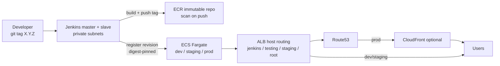

# FlowHarbor — Prod-Grade CI/CD Case Study (Jenkins + ECS Fargate + Terraform)

> A tag-based, per-environment delivery platform for a Next.js app on AWS: Jenkins CI/CD → ECR (immutable, scanned) → ECS Fargate (digest-pinned, rolling) behind ALB + optional CloudFront, all provisioned with modular Terraform.

This repo is structured as a **production case study**: a small demo app (`app/`) used to demonstrate how a real team would ship safely — semver releases, promotion gates, hardened containers, WAF, secrets hygiene, and auditable infrastructure.

Live topology (from `terraform/outputs.tf`):

| Environment | URL | Jenkins job | Notes |
|---|---|---|---|
| Dev | `https://testing.flowharbor.in` | `flowharbor-dev` | Manual trigger, `GIT_TAG` param |
| Staging | `https://staging.flowharbor.in` | `flowharbor-staging` | Release validation target |
| Prod | `https://flowharbor.in` | `flowharbor-prod` | Approval gate + staging promotion check |
| CI | `https://jenkins.flowharbor.in` | — | Jenkins master behind ALB + WAF |

---

## 1. Architecture



Request path:

1. **Edge:** Prod (`flowharbor.in`) optionally routes through CloudFront (`terraform/modules/cloudfront`). Dev/staging go direct to ALB. Toggle with `./cloudfrontctl.sh` (see §7).
2. **Load balancer:** Single shared ALB (`terraform/modules/alb`) does host-based routing + TLS termination (ACM certs in `terraform/modules/acm`).
3. **Compute:** One ECS cluster, three Fargate services (`flowharbor-dev/staging/prod` in `terraform/modules/ecs`). One task per service in this study config.
4. **CI:** Jenkins master + slave on EC2 in private subnets (`terraform/modules/jenkins-master`, `jenkins-slave`), reached via ALB. No polling/webhooks — manual, tag-driven.

Network: VPC (`10.0.0.0/16` default, `terraform/variables.tf`) with 2 public + 2 private subnets across 2 AZs, NAT + VPC endpoints (`terraform/modules/vpc`). Security groups in `terraform/modules/security-groups`, WAF in `terraform/modules/waf`, logs/KMS/GuardDuty wired in `main.tf`.

---

## 2. Tech stack

| Layer | Choice | Why it matters |
|---|---|---|
| App | Next.js `standalone` + React 19, Tailwind (`app/package.json`, `app/next.config.js`) | Small, self-contained image (`server.js`); strict security headers (HSTS, CSP, `X-Frame-Options: DENY`) |
| Container | Multi-stage `node:*-alpine`, `USER node`, `HEALTHCHECK`, readonly root FS (`app/Dockerfile`) | Non-root, minimal attack surface; ECS asserts these on every deploy |
| Pipeline | Jenkins declarative, `agent: jenkins-slave` (`Jenkinsfile:71`) | Reproducible, tag-reproducible builds; manual promotion, not push-to-prod |
| Registry | ECR private, immutable tags, scan-on-push | `Jenkinsfile:238` fails the build on `CRITICAL` findings |
| Orchestration | ECS Fargate + ALB target groups | No nodes to manage; rolling updates with `services-stable` wait |
| IaC | Terraform `>= 1.10`, AWS provider `~> 5.0` (`terraform/versions.tf`), 13 modules | Clear blast radius per component; `terraform fmt/validate/plan` enforced by `cloudfrontctl.sh:98` |
| Edge/DNS | ACM (regional + `us-east-1` for CF), Route53, CloudFront, WAFv2 | TLS everywhere; Jenkins locked behind IP allowlist + `/login` rate limit |
| Supply chain | Dependabot (npm/docker/actions), CodeQL `security-extended` (`.github/`) | Weekly updates + static analysis on `main` |

---

## 3. Repository map

```
.
├── Jenkinsfile            # Whole delivery story: checkout → build → push → approve → deploy
├── app/                   # Next.js demo (particle hero, env/version badges from runtime-config.js)
│   ├── Dockerfile         # builder → runner, standalone output, USER node
│   ├── entrypoint.sh      # Generates public/runtime-config.js safely at boot (XSS-escaped)
│   ├── next.config.js     # standalone + global security headers
│   └── src/app/           # page.tsx, layout.tsx, api/, globals.css
├── terraform/
│   ├── main.tf            # 13 modules in dependency order + GuardDuty
│   ├── variables.tf       # Region, domain, CloudFront/WAF/DNSSEC toggles
│   ├── outputs.tf         # URLs, ECR, WAF ARN, SSM password command
│   ├── backend.tf         # Local state default; documented S3+KMS+lockfile path
│   ├── modules/{vpc,security-groups,iam,ecr,acm,jenkins-master,jenkins-slave,
│   │            alb,waf,ecs,cloudfront,route53,observability-logging}/
│   └── user-data/         # EC2 bootstrap for Jenkins master/slave
├── cloudfrontctl.sh       # status|add|remove|plan|apply for the CDN toggle
├── .github/workflows/codeql.yml  # CodeQL on push/PR + weekly cron
└── SECURITY.md            # Supported versions, private reporting, branch/tag rulesets
```

---

## 4. CI/CD — tag in, digest out

Defined in `Jenkinsfile`. Three Jenkins jobs map 1:1 to environments via `TARGET_ENV = JOB_NAME.tokenize('-').last()` (`Jenkinsfile:106`). Each run takes one param: `GIT_TAG` (semver `X.Y.Z[-prerelease][+build]`).

| Stage | What happens | File |
|---|---|---|
| `Checkout Tag` | Validate env allowlist + semver; `git fetch --tags`; resolve tag → immutable 40-char SHA; verify signature (warn if unsigned); `git clean -fdx` + checkout SHA; sanitize author (strip newlines, allowlist, 32 chars) | `Jenkinsfile:120` |
| `Build` | `npm ci --ignore-scripts && npm audit --audit-level=high`; validate ECR URL against strict regex; `docker build -t $ECR:$GIT_TAG` (no `:latest`) | `Jenkinsfile:178` |
| `Push to ECR` | ECR login; push tag; resolve `imageDigest` via `describe-images`; cross-check `docker inspect RepoDigests`; `wait image-scan-complete` and fail on `CRITICAL > 0`; archive `image-metadata-$BUILD_ID.json` | `Jenkinsfile:211` |
| `Approval` (prod only) | `input ok:'Deploy to prod', submitter:'release-managers,admin'`, 30-min timeout | `Jenkinsfile:268` |
| `Deploy` → `promote(env)` | Fetch current TD; enforce digest pin (`@sha256:` required); prod promotion-chain check (image must equal staging TD image); semver downgrade guard; no-op skip if identical; publish `GIT_AUTHOR`/`PIPELINE_URL` to SSM SecureString; mutate-in-place container def (preserves `user`, `readonlyRootFilesystem`, `healthCheck`, mounts, `secrets`); register new revision; assert hardening; `update-service` + `wait services-stable` (10-min cap) | `Jenkinsfile:362` |

Key production decisions:

- **No `:latest`, ever.** ECR is immutable; deploys reference `repo@sha256:…` (`Jenkinsfile:406`).
- **Tags are mutable, SHAs aren't.** Resolve immediately (`Jenkinsfile:143`) and deploy the SHA.
- **Promotion chain, not cherry-picks.** Prod refuses any image not already running in staging (`Jenkinsfile:414`).
- **Downgrades are explicit.** Older semver over newer fails closed (`Jenkinsfile:435`).
- **Secrets stay secrets.** `GIT_AUTHOR`/`PIPELINE_URL` travel via SSM SecureString + TD `secrets`, never plaintext `environment`; post-register assertions verify it (`Jenkinsfile:547`).

Release flow:

```bash
git tag 1.2.3 && git push origin 1.2.3
# Jenkins → run flowharbor-staging, GIT_TAG=1.2.3 → verify https://staging.flowharbor.in
# Jenkins → run flowharbor-prod, GIT_TAG=1.2.3 → approve → https://flowharbor.in
```

---

## 5. Infrastructure — modular Terraform

Root orchestration in `terraform/main.tf` (VPC → SG → IAM → ECR → ACM → Jenkins → ALB → WAF → ECS → CloudFront → Route53, plus S3/KMS logging + GuardDuty).

| Module | Owns |
|---|---|
| `vpc` | VPC, 2 public + 2 private subnets, NAT/IGW, endpoints, flow logs → KMS-encrypted bucket |
| `security-groups` | ALB (80/443), Jenkins master (8080 via ALB, 50000 via slave), slave egress-only, ECS tasks (from ALB) |
| `iam` | Jenkins master/slave instance roles (scoped SSM + ECR/ECS), ECS execution/task roles |
| `ecr` | Private repo, immutable tags, lifecycle policy |
| `acm` | ALB cert (regional) + CloudFront cert (`us-east-1`, AWS hard requirement) via DNS validation |
| `jenkins-master/slave` | EC2 + user-data bootstrap (`terraform/user-data/`), SSM-stored creds |
| `alb` | HTTPS listener, host rules, access logs to encrypted bucket |
| `waf` | Regional Web ACL on ALB: Jenkins IP allowlist (default-deny), `/login` rate limit, AWS managed rules; default-allow so app traffic is unaffected |
| `ecs` | Cluster + `flowharbor-{dev,staging,prod}` Fargate services, execution/task roles, CloudWatch logs (KMS) |
| `cloudfront` | Optional CDN for prod only (`count = var.enable_cloudfront`), origin-verify header, logging |
| `route53` | `jenkins/testing/staging` → ALB alias; apex → CloudFront or ALB depending on toggle; optional DNSSEC |
| `observability-logging` | Central S3 log bucket + KMS CMK for ALB/CF/VPC logs |

Variables of interest (`terraform/variables.tf`): `aws_region` (default `ap-south-1`), `enable_cloudfront` (default `false`), `cloudfront_origin_verify_token` (≥32 chars when CDN on), `alb_restrict_to_cloudfront` (keep `false` on single-ALB stack), `jenkins_allowed_ipv4_cidrs` (default `[]` = deny all to Jenkins), `jenkins_login_rate_limit` (100–20000).

State: local by default for zero-setup demo. For team/prod, follow `terraform/backend.tf` — pre-create versioned, KMS-encrypted S3 bucket with public-access block + TLS-only policy, then enable `use_lockfile = true`.

---

## 6. Security posture (auditable)

- **Pipeline:** ECR URL allowlist blocks exfil to foreign registries (`Jenkinsfile:32`); shell/JS injection blocked via semver gate + `JSON.stringify` escaping in `app/entrypoint.sh:32`; workspace secrets shredded (`Jenkinsfile:294,537`).
- **Container:** digest-pinned base (`app/Dockerfile:1`), `npm audit signatures` + `audit-level=high` in build, non-root, readonly FS, `/tmp` + `/app/public` mounts, healthcheck.
- **Edge:** WAF allowlist + rate limit (`variables.tf:101`), origin-verify token for CF→ALB (`variables.tf:66`), strict CSP/HSTS in `app/next.config.js:1`.
- **Repo:** `SECURITY.md` — signed tags on `refs/tags/*`, protected `main`, secret scanning + push protection; never commit `.env`/`*.pem`/`terraform.tfvars`/`*.tfstate`. CodeQL `security-extended` runs on push/PR/weekly (`.github/workflows/codeql.yml`).
- **Runtime config:** `entrypoint.sh` caps every value, allowlists `ENV`, validates `PIPELINE_URL` as `http(s)`, caps payload at 8 KiB, writes canary + versioned `runtime-config.<ver>-<sha>.js`.

---

## 7. Operations

```bash
cp terraform/terraform.tfvars.example terraform/terraform.tfvars  # set domain_name, hosted_zone_id
cd terraform && terraform init && terraform plan && terraform apply

./cloudfrontctl.sh status   # enabled | disabled | enabled (default)
./cloudfrontctl.sh add      # stage enable_cloudfront=true in tfvars
./cloudfrontctl.sh plan     # fmt -check + validate + plan
./cloudfrontctl.sh apply    # apply plan file if present
```

Useful outputs (`terraform/outputs.tf`): app URLs, `ecr_repository_url`, `waf_web_acl_arn`, and `jenkins_admin_password_command` (SSM). Jenkins nodes are reachable via SSM Session Manager using the instance-ID outputs.

Local app dev:

```bash
cd app && npm ci && npm run dev      # http://localhost:3000
docker build -f app/Dockerfile -t flowharbor:local app/
```

---

## 8. Design trade-offs & limits (honest notes)

- **Single shared ALB** keeps cost low but means `alb_restrict_to_cloudfront=true` would break direct `jenkins/testing/staging` hosts — split prod to a dedicated ALB before enforcing CF-only ingress.
- **One task per service** is demo-sized; scale `desired_count`/autoscaling + multi-AZ placement for real load.
- **Manual Jenkins triggers** are intentional (auditable releases) at the cost of velocity vs. webhook/GitOps flow.
- **Local TF state default** is convenient for study; remote S3 + lockfile is required for team use.

---

## 9. What this case study demonstrates

End-to-end ownership of a production-shaped path: semver release → scanned immutable artifact → digest-pinned rolling deploy → gated promotion → WAF'd edge → encrypted logs, with every shortcut (mutable tags, `:latest`, plaintext secrets, silent downgrades) explicitly closed in code and asserted at deploy time.
