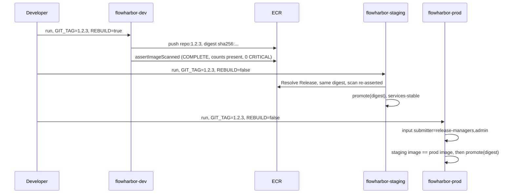

# FlowHarbor — a Next.js  app delivered by Jenkins → ECR → ECS Fargate, provisioned with Terraform

This repo is a case study in delivery mechanics: a small but real Next.js todo app (`app/`)
is built, scanned, and deployed to AWS ECS Fargate by a tag-driven Jenkins → ECR → ECS
pipeline, with the CI, IaC, and security decisions that make every gate in the delivery
path **fail closed** rather than decorative. A reviewer with no AWS account, no cluster,
and no paid Jenkins run can clone it, run the whole quality suite, validate the pipeline
with Jenkins' own declarative linter, and `terraform validate` the infrastructure.


| Environment | Intended URL | Jenkins job | Parameters |
|---|---|---|---|
| Dev | `https://testing.flowharbor.in` | `flowharbor-dev` | `GIT_TAG`, `REBUILD` (default **true**), `ALLOW_UNSIGNED_TAGS` |
| Staging | `https://staging.flowharbor.in` | `flowharbor-staging` | `GIT_TAG`, `REBUILD` (default false), `ALLOW_UNSIGNED_TAGS` |
| Production | `https://flowharbor.in` | `flowharbor-prod` | as staging, plus the `Approval` gate |
| CI | `https://jenkins.flowharbor.in` | — | controller behind ALB + WAF allowlist |

## 1. What is verified, and how

Every row was executed in this repo unless it says otherwise. None involves
`terraform apply`, a running AWS account, or a paid Jenkins build.

| Check | Exact command | Observed result |
|---|---|---|
| Typecheck / lint | `cd app && npm run typecheck` · `npm run lint` | both clean, no output |
| Tests + coverage gate | `cd app && npm run test:coverage` | 11 files / 77 tests pass; 88.33% statements, 86.93% branches, 97.5% functions — every configured threshold met, exit 0 |
| Build | `cd app && npm run build` | success; route table lists `ƒ /` and `ƒ /api/health` |
| Health endpoint | `npm run start`, then `curl -i localhost:3000/api/health` | `200`, `Cache-Control: no-store`, `"status":"ok"`, `"env":"dev"`, `checks.database` present; with `DATA_BACKEND=dynamodb` and an empty `TODO_TABLE`: `503`, `"status":"degraded"` |
| Seeded rows render | `curl -s localhost:3000/ \| grep -o 'data-done=' \| wc -l` | `3` |
| Todo UI | browser against `next start` | create → toggle → delete reflect immediately; a reload shows the current list, and restarting the server resets to the 3 seeds (in-memory, process-level store by design) |
| Terraform | `terraform -chdir=terraform init -backend=false -input=false` → `fmt -check -recursive` → `validate` | `fmt` prints nothing; `validate` prints `Success! The configuration is valid.`; `terraform/bootstrap` validates too |
| User-data shell | `bash -n terraform/user-data/*.sh` | passes for `jenkins-master.sh` and `jenkins-slave.sh` |
| Pipeline syntax | `POST /pipeline-model-converter/validate` on a local controller (Jenkins 2.568.3 LTS, same plugin list) | `Jenkinsfile successfully validated.` |
| Jenkins as code | boot a local controller with `jenkins/casc/jenkins.yaml` | import applies with no errors; the three jobs exist; `REBUILD` default `true` for dev, `false` for staging; anonymous `POST /job/flowharbor-dev/build` → `403`, admin → `201` |
| CI install | `npm ci --ignore-scripts` on a clean checkout | typecheck clean, 11 files / 77 tests pass, thresholds met — install scripts are skipped and nothing needs them |
| IaC misconfiguration scan | `.github/workflows/terraform.yml` (runs on `main`) | green on `main` at `e88a929` (2026-09-26), Trivy `v0.74.0`: `trivy config --severity HIGH,CRITICAL --exit-code 1` over the repo root. The first real run reported **6** findings — one public ALB (`AWS-0053`) and five port-scoped egress rules (`AWS-0104`) — both ids suppressed in `.trivyignore` with written justifications. The gate is still armed: the same scan with an empty ignore file exits `1`. `fmt`, `init` and `validate` pass in the same run |

Provider is `hashicorp/aws 5.100.0`, pinned by the committed `terraform/.terraform.lock.hcl` (`.gitignore:4`).

Every row above is evidence about the date it names and the versions it pins. A green run is not
a standing guarantee: the action, Trivy's check bundle, and the provider lock all move, so the
honest reading of this table is "verified on that day, against those versions".

## 2. Repository map

| Path | What lives there |
|---|---|
| `Jenkinsfile` | The delivery story: 7 stages, every gate, rollback, SNS notification |
| `app/` | Next.js 16.3.5 / React 19 / TS 5.9.3, `output: "standalone"`, security headers (`app/next.config.js:37`) |
| `app/src/lib/` | Runtime-config parser/escaper, health payload, `cn()` |
| `app/src/lib/todos/` | The todo data layer: `types`, `validate`, `memory`, `dynamodb`, `repository` — in-memory locally, DynamoDB in ECS |
| `app/src/app/` | `page.tsx`, `todos/actions.ts` (server actions at `app/src/app/todos/actions.ts:9`, `:21`, `:34`), `api/health/route.ts` (200/503, 2 s DB timeout, `no-store`) |
| `app/src/components/` | Todo panel, runtime badges, particle field, and the four `ui/` primitives the app now uses |
| `app/entrypoint.sh` | Boot-time `runtime-config.js` generation — `RUNTIME_CONFIG_DIR` (`app/entrypoint.sh:15`) makes the output dir overridable, `FLOWHARBOR_SKIP_EXEC=1` (`app/entrypoint.sh:57`) makes it testable |
| `app/tests/` | `entrypoint.test.ts` runs the real `entrypoint.sh` in a temp dir and asserts the boot-config escaping contract |
| `.github/workflows/` | `ci.yml` (lint + typecheck + coverage on Node 22 and 24, lcov artifact), `terraform.yml` (`fmt -check -recursive`, `init -backend=false`, `validate`, `trivy config` misconfiguration scan), `codeql.yml` (push/PR + weekly cron) |
| `.github/dependabot.yml` | 4 ecosystems (npm in 2 groups, docker, github-actions, terraform), weekly Monday 09:00 UTC, limit 5 |
| `.trivyignore` | Two check ids with written justifications: `AWS-0053` (the ALB is deliberately internet-facing behind WAF) and `AWS-0104` (five tcp/80-443 egress rules reaching dynamic AWS endpoints and package registries). Severity and `exit-code` stay strict — an empty ignore file still fails the scan |
| `jenkins/casc/jenkins.yaml` | Configuration-as-Code: security realm, matrix authorization, `numExecutors: 0`, Job DSL import (`jenkins/casc/jenkins.yaml:84`) |
| `terraform/main.tf` | Root: 16 modules in dependency order, provider `default_tags`, cost budget |
| `terraform/modules/` | `vpc`, `security-groups`, `iam`, `ecr`, `acm`, `alb`, `waf`, `ecs`, `cloudfront`, `route53`, `observability-logging`, `jenkins-master`, `jenkins-slave`, `dynamodb`, `monitoring`, `governance` |
| `terraform/modules/dynamodb/` | PAY_PER_REQUEST todo table, `pk` hash key, SSE-KMS, PITR, deletion protection |
| `terraform/modules/monitoring/` | 1 dashboard + 7 alarms, SNS actions, `treat_missing_data = "notBreaching"` |
| `terraform/modules/governance/` | AWS Config recorder/delivery + 3 managed rules, Security Hub account + Foundational standard |
| `terraform/bootstrap/`, `terraform/backend.tf` | Separate root module: versioned, SSE-KMS state bucket, public access block, TLS-only policy, 90-day noncurrent expiry. The S3 backend block stays commented so a clone can `init` with zero AWS access |
| `terraform/user-data/jenkins-master.sh` | Controller bootstrap: plugins, JCasC systemd env (`terraform/user-data/jenkins-master.sh:227`), job-existence assertion, SSM credentials |
| `terraform/user-data/flowharbor-jobs.groovy` | Terraform-rendered Job DSL: the three jobs and their parameter defaults (`terraform/user-data/flowharbor-jobs.groovy:26`) |
| `terraform/user-data/jenkins-slave.sh` | Agent bootstrap incl. Node 22 via NodeSource, asserted with `node --version` (`terraform/user-data/jenkins-slave.sh:226`) |
| `cloudfrontctl.sh`, `SECURITY.md`, `LICENSE` | `status`/`add`/`remove`/`plan`/`apply` for the CloudFront toggle; security policy; MIT |
| `docs/` | Long-form documentation set: architecture, threat model, ADRs, operations runbook, cost model, demo script — linked from §10 |

## 3. How the release works

Three jobs, one per environment, generated from the Job DSL at controller boot.
The environment comes from the job name, not from a parameter (`Jenkinsfile:168`),
so a job cannot be pointed at an environment it does not own.

| # | Stage | What it does |
|---|---|---|
| 1 | `Checkout Tag` (`Jenkinsfile:182`) | environment allowlist, semver validation, tag → 40-char SHA, signature probe, `git clean -fdx`, author sanitisation |
| 2 | `Verify` (`Jenkinsfile:246`) | `npm ci --ignore-scripts` + lint + typecheck + coverage on the agent, then a CycloneDX SBOM archived as an artifact (`Jenkinsfile:254`) |
| 3 | `Build` (`Jenkinsfile:266`) | `npm audit --audit-level=high` (`Jenkinsfile:281`), ECR URL allowlist, `docker build` tagged with the git tag — never `:latest` |
| 4 | `Push to ECR` (`Jenkinsfile:300`) | ECR login, push, resolve digest, cross-check `RepoDigests`, then the scan gate |
| 5 | `Resolve Release` (`Jenkinsfile:352`) | runs **only** when `REBUILD=false`: resolve the existing image for the tag, validate the digest, re-run the scan gate independently |
| 6 | `Approval` (`Jenkinsfile:400`) | production only, `input` restricted to `release-managers,admin` (`Jenkinsfile:406`) |
| 7 | `Deploy` (`Jenkinsfile:415`) | `promote()`: digest pin, promotion chain, downgrade guard, in-place container-definition mutation, 8 hardening asserts, `update-service` + `wait services-stable` |

**The rule that matters:** dev *builds*; staging and prod *promote the same digest*. `Build` and
`Push to ECR` are guarded on `REBUILD=true`; `Resolve Release` is guarded on `REBUILD=false`
and runs the scan gate on its own, so a promotion can never rebuild, substitute, or skip it.


```mermaid
sequenceDiagram
    participant D as Developer
    participant J as flowharbor-dev
    participant E as ECR
    participant S as flowharbor-staging
    participant P as flowharbor-prod
    D->>J: run, GIT_TAG=1.2.3, REBUILD=true
    J->>E: push repo:1.2.3, digest sha256:...
    J->>E: assertImageScanned (COMPLETE, counts present, 0 CRITICAL)
    D->>S: run, GIT_TAG=1.2.3, REBUILD=false
    S->>E: Resolve Release, same digest, scan re-asserted
    S->>S: promote(digest), services-stable
    D->>P: run, GIT_TAG=1.2.3, REBUILD=false
    P->>P: input submitter=release-managers,admin
    P->>P: staging image == prod image, then promote(digest)
```

## 4. The gates

| Gate | What makes it fail | Enforced at |
|---|---|---|
| Environment allowlist | `JOB_NAME` not ending in `dev`/`staging`/`prod` | `Jenkinsfile:185` |
| Semver validation | `GIT_TAG` not `^[0-9]+\.[0-9]+\.[0-9]+(-…)?(\+…)?$`, or unresolvable to a 40-hex SHA | `Jenkinsfile:199`, `Jenkinsfile:206` |
| Signed-tag refusal | `git verify-tag`/`verify-commit` reports *no signature found* or *cannot verify*, and `ALLOW_UNSIGNED_TAGS != 'true'` | `Jenkinsfile:212` (probe), `Jenkinsfile:216` (refusal) |
| Dependency audit | `npm audit --audit-level=high` exits non-zero | `Jenkinsfile:281` |
| Image exists for promotion | no image for the tag in ECR, or a digest that is not `sha256:<64 hex>` | `Jenkinsfile:374`, `Jenkinsfile:377` |
| ECR scan completed | `scanStatus` never reaches `COMPLETE` in 5 min → refuses to deploy an unscanned image. No `\|\| true` on this path | `Jenkinsfile:100` |
| ECR scan findings present | response has no `findingSeverityCounts` key at all — an empty result is **not** a pass | `Jenkinsfile:112` |
| ECR scan severity | `CRITICAL > 0` | `Jenkinsfile:116` |
| Digest pinning | image about to be registered does not contain `@sha256:` | `Jenkinsfile:580` |
| Staging promotion chain | image in the `flowharbor-staging` task definition differs from the one being deployed to prod | `Jenkinsfile:595` |
| Semver downgrade guard | target version lower than what the service currently runs | `Jenkinsfile:611` |
| Production approval | not run on `flowharbor-prod`, or the `input` not approved by a submitter | `Jenkinsfile:401`, `Jenkinsfile:406` |
| Post-registration hardening | 8 asserts: digest pin, `user == node`, `readonlyRootFilesystem`, `healthCheck`, `/tmp` and `/app/public` mounts, `GIT_AUTHOR`/`PIPELINE_URL` present as secrets and absent from `environment` | `Jenkinsfile:741`–`Jenkinsfile:748` |
| Automatic rollback | `DEPLOY_ATTEMPTED == 'true'` and the build failed → restore the captured previous revision, wait for `services-stable` again | `Jenkinsfile:628` (capture), `Jenkinsfile:759` (arm), `Jenkinsfile:489` (rollback) |
| Deployment outcome | published to SNS on success and on failure | `Jenkinsfile:470`, `Jenkinsfile:509` |

No delivery gate swallows an error. The ECR scan path contains no `|| true` at all, and
`grep -c '|| true' Jenkinsfile` returns exactly `3`: a comment at `Jenkinsfile:79` that records
the old fail-open wait, the signature probe at `Jenkinsfile:212` (which only captures the
verifier's output — the gate is the `error` at `Jenkinsfile:216`), and the best-effort `shred -u`
of a temp task-definition file at `Jenkinsfile:722`, which runs with `returnStatus: true` and
whose result never lets a deploy proceed. A fourth would mean someone added a real one.

## 5. Infrastructure

16 modules plus the root, orchestrated in `terraform/main.tf` in dependency order.
Provider-level `default_tags` (`terraform/main.tf:39`, `terraform/main.tf:63`) apply
`Project`/`ManagedBy`/`Repo` to every taggable resource.

| Module | Owns | Why it is here |
|---|---|---|
| `vpc` | VPC, 2 public + 2 private subnets, NAT, endpoints, flow logs | Foundation; logs land in a KMS-encrypted bucket |
| `security-groups` | ALB, controller, egress-only agent, task SGs | Least privilege between tiers |
| `iam` | Controller/agent instance roles, ECS execution + task roles | Per-role policies: scoped SSM, ECR/ECS, `sns:Publish` on one topic (`terraform/modules/iam/main.tf:372`), DynamoDB item actions on the todo table only (`terraform/modules/iam/main.tf:555`) |
| `ecr` | Private repo, immutable tags, lifecycle | Artifact store the pipeline cannot rewrite |
| `acm`, `route53` | Regional ALB cert + `us-east-1` cert (a hard CloudFront requirement); `jenkins`/`testing`/`staging` → ALB alias, apex → CDN or ALB, optional DNSSEC | TLS everywhere, and the names of the intended endpoints above |
| `alb` | HTTPS listener, host routing, access logs | One shared listener for all four hostnames |
| `waf` | Regional ALB ACL (Jenkins IP allowlist, `/login` rate limit, managed rules), WAF request logging, and a **CLOUDFRONT-scope ACL** | The CloudFront ACL used to exist and was never attached; it is now created only when `enable_cloudfront` is true and wired through `web_acl_id` (`terraform/main.tf:354`). Request logs go to a 30-day log group (`terraform/modules/waf/main.tf:248`) with `authorization` and `cookie` redacted (`terraform/modules/waf/main.tf:262`) |
| `ecs` | Cluster + `flowharbor-{dev,staging,prod}` Fargate services, autoscaling, KMS-encrypted logs | Tasks get `DATA_BACKEND`/`TODO_TABLE` (`terraform/modules/ecs/main.tf:165`) so the app talks to DynamoDB everywhere; `enable_execute_command` is set on all three services |
| `cloudfront` | Optional prod CDN, origin-verify header, logging | Off by default; the WAF association is a reason to turn it on |
| `observability-logging` | Central log bucket, KMS CMK, and the **alerts SNS topic** | The topic lives here so `iam` can grant `sns:Publish` on it without an ownership cycle (`terraform/modules/observability-logging/main.tf:25`) |
| `jenkins-master` / `jenkins-slave` | EC2 + user-data bootstrap | Real RBAC via JCasC instead of a comment in a shell script |
| `dynamodb` | `flowharbor-todos` table | Was a self-flagged stub; the app now has a real backend in ECS |
| `monitoring` | 1 dashboard + 7 alarms | Was absent; every alarm has `alarm_actions`/`ok_actions` and `treat_missing_data = "notBreaching"` |
| `governance` | AWS Config recorder/delivery + 3 ADVISORY rules, Security Hub account + Foundational standard | Was absent |
| `bootstrap/` (separate root) | Versioned, SSE-KMS state bucket, public access block, TLS-only policy, 90-day noncurrent expiry | The S3 backend block stays commented so a clone can `init` with zero AWS access; this module is the documented path to remote state |
| root `aws_budgets_budget` | `COST` budget with an 80% email notification (`terraform/main.tf:125`) | The subscriber list defaults to empty on purpose: the budget still reports, with nobody hardcoded into the repo |

## 6. App quality gates

```bash
cd app
npm ci
npm run lint        # eslint .
npm run typecheck   # tsc --noEmit
npm run test        # vitest run
npm run test:coverage
npm run build
npm run sbom        # CycloneDX 1.6, dev dependencies omitted
```

- **11 test files, 77 test cases**, covering runtime-config parsing and escaping,
  the `entrypoint.sh` boot-config shell contract, the in-memory and DynamoDB
  repositories, the health payload and route, the server actions, and the todo UI.
- **Coverage thresholds are enforced, not decorative** (`app/vitest.config.ts:31`): global 70%
  lines / 70% functions / 70% statements / 60% branches, and `src/lib/**` at 90/90/90/85
  (`app/vitest.config.ts:37`) — the run fails if any of them is missed. Last recorded run:
  88.33% statements, 86.93% branches, 97.5% functions.
- **`entrypoint.sh` is tested as a program, not as a string.** `app/tests/entrypoint.test.ts` runs
  it with `RUNTIME_CONFIG_DIR` and `FLOWHARBOR_SKIP_EXEC=1`, asserting an injected newline cannot
  split the generated file, `</script>` never appears raw, `PIPELINE_URL=javascript:…` degrades
  to `"#"`, and a bogus `ENV` becomes `"dev"`.
- `next` is pinned to `16.3.5` (`app/package.json:27`) and the base image is
  digest-pinned in both Dockerfile stages (`app/Dockerfile:1`).

## 7. Running it locally

```bash
cd app && npm ci && npm run lint && npm run typecheck && npm run test:coverage && npm run build
terraform -chdir=terraform init -backend=false -input=false && terraform -chdir=terraform fmt -check -recursive && terraform -chdir=terraform validate
docker run --rm -e JAVA_OPTS=-Djenkins.install.runSetupWizard=false jenkins/jenkins:lts-jdk21   # then POST the Jenkinsfile to /pipeline-model-converter/validate
```

**You will see:** the app on `localhost:3000` with a working todo list (3 seeds, create/toggle/delete,
health at `/api/health`), a green quality suite, a validated Terraform configuration, and a
Jenkinsfile that passes Jenkins' own declarative linter.

**You will not see:** any AWS resource, any deployed endpoint, live WAF blocks,
alarm delivery, DynamoDB behaviour under failure, or a real deploy. `terraform plan`
is deliberately not part of offline verification — the availability-zone data source
needs credentials; the runbook documents it for the operator instead.

## 8. Verified vs asserted

| This repo proves | This repo cannot prove |
|---|---|
| The app builds, lints, typechecks, and its 77 tests pass with enforced coverage thresholds | Anything about a running deployment |
| The Jenkinsfile is valid declarative pipeline syntax on Jenkins 2.568.3 LTS with the shipped plugin list | That any build was ever triggered or succeeded on a real controller |
| JCasC imports cleanly, the three jobs exist, and matrix authorization denies anonymous `Job/Build` (403) | That branch protection, rulesets, secret scanning, or push protection are enabled — those are repository settings, not code |
| The Terraform configuration is `fmt`-clean and `validate`-clean with `-backend=false` | Actual IAM role membership in a real account, or that any policy is attached to anything |
| User-data scripts are syntactically valid, and the Job DSL copy in `jenkins-master.sh` is byte-identical to `flowharbor-jobs.groovy` | Live DNS, ACM issuance, or that `flowharbor.in` and friends resolve or serve this app |
| Every gate in §4 is present in the pipeline source at the cited line | Live WAF blocks, live alarm/SNS delivery, DynamoDB behaviour under failure |
| The misconfiguration scan runs on every push and pull request, fails on HIGH/CRITICAL, and its six current findings are triaged on the record | That the two suppressed ids stay justified as the architecture changes, or that the pinned check bundle still covers this stack's surface. Both are re-asserted only by a human reading `.trivyignore`, and a bare id suppresses that check everywhere, including occurrences that do not exist yet |
| The provider is pinned to `hashicorp/aws 5.100.0` by a committed lock file | Measured monthly cost — the cost model is a labelled estimate with a measurement command, not a bill |
| Deploys use a digest, never a mutable tag, and a rollback path exists in source | ECS task-definition revision history, uptime, throughput, or any SLO |

Deviations from the original plan, decided on evidence:

| Deviation | Evidence |
|---|---|
| `timestamper` added to the plugin list | The pipeline calls `timestamps()`; the linter rejected it otherwise, so the shipped pipeline could never have run on the shipped plugin list |
| `matrix-auth` Global Matrix instead of role-strategy | role-strategy 3.x exposes no JCasC symbol for `authorizationStrategy`; `roleBased` failed to configure. `Job/Input/Proceed` does not exist as a permission — the prod gate is the `input` submitter list plus `Job/Build` (`jenkins/casc/jenkins.yaml:51`) |
| No seed job | `jobs: - file:` creates the three jobs at import time, which is what `numExecutors: 0` demands; `jenkins-master.sh` asserts all three exist and exits 1 otherwise (`terraform/user-data/jenkins-master.sh:347`) |
| Budget uses `limit_amount`/`limit_unit` + a `notification` block | `limit` is gone from the resource and `aws_budgets_budget_action` needs an execution role and cannot send email |
| Security Hub subscribes the Foundational standard by ARN | `enable_default_security_controls` and `data "aws_securityhub_standards"` do not exist on provider 5.x |
| `enable_execute_command` only, no `executeCommandConfiguration` | The block does not exist on `aws_ecs_service` in provider 5.x; exec output goes to each service's existing awslogs group |
| `all_supported` inside `recording_group` | Provider 5.x has no such arguments at the resource top level (`terraform/modules/governance/main.tf:155`) |
| Pre-existing Groovy bug in workspace cleanup fixed | The double-quoted `${WORKSPACE_TMP:-}` was not valid Groovy interpolation and made the pipeline unparseable; the declarative linter caught it |

## 9. Trade-offs, stated plainly

- **One shared ALB** for all four hostnames keeps cost down, but you cannot restrict
  the ALB to CloudFront-only ingress without also breaking the direct
  `jenkins`/`testing`/`staging` hosts. Split prod onto its own ALB first.
- **Local Terraform state by default** so a clone validates with zero AWS access.
  Remote state is a documented path (`terraform/bootstrap/`), not the default.
- **Manual triggers only** — no webhooks, no GitOps. Releases are auditable; velocity
  is not the goal.
- **The todo app has no authentication.** Anyone who can reach it can read and write
  the list. The security story here is the edge and the delivery path — WAF allowlist,
  digest pinning, IAM scoping — not the app's own access control.
- **In-memory backend locally.** `npm run dev` works with zero AWS. The store is a process-level
  singleton, so a page reload shows the current list and only restarting the server returns the
  seeds; `DATA_BACKEND` is `dynamodb` in ECS, where nothing is lost on restart.
- **ECS Exec is enabled** on all three services: a deliberate trade of blast radius for debuggability.

## 10. Further reading

| Document | Question it answers |
|---|---|
| [Architecture](docs/architecture.md) | How does a request reach a task, and how does a tag reach one? |
| [Threat model](docs/threat-model.md) | What is being protected, from whom, and where are the trust boundaries? |
| [ADRs](docs/adr/) | Why this design rather than the obvious alternative, one decision per file |
| [Operations](docs/operations.md) | Bootstrap order, deploy and rollback runbooks, per-gate failure-modes table with the exact log line to grep |
| [Cost model](docs/cost-model.md) | What this costs per month, labelled an estimate, and how to measure it |
| [Demo script](docs/demo-script.md) | A 5-minute reviewer walkthrough |
| [Security policy](SECURITY.md) | What the pipeline enforces, the one override, and what an operator must confirm in GitHub settings |
