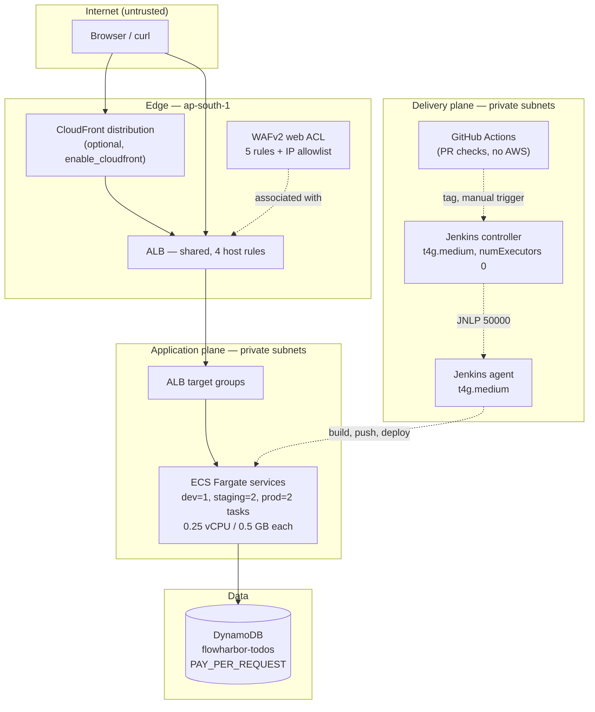
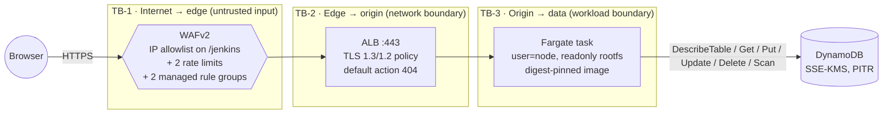
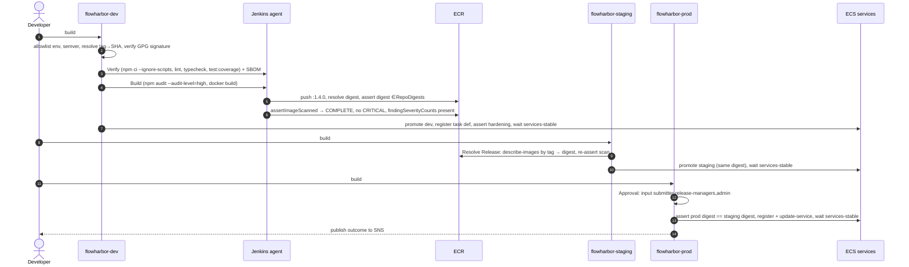
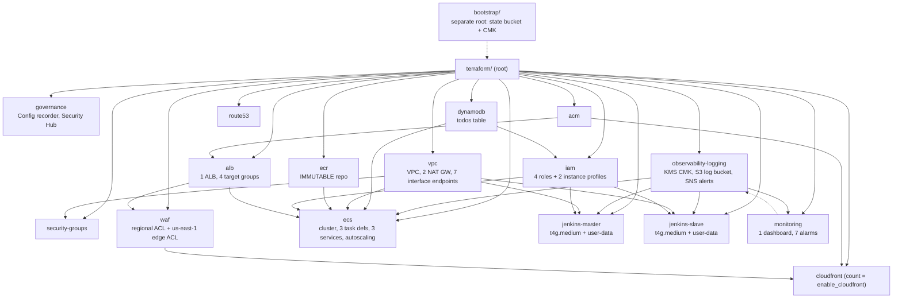
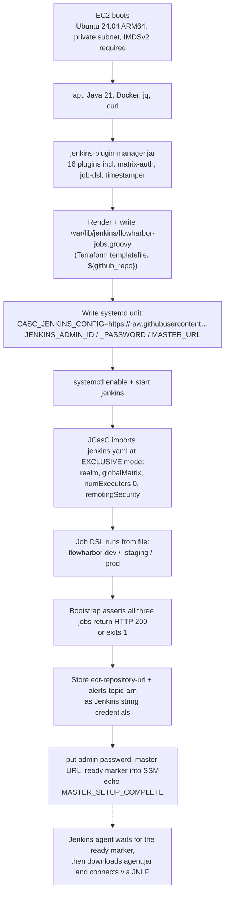

# Architecture

FlowHarbor is a small todo web app whose purpose is to be *carried* by a real release pipeline: every stage, gate and rollback below exists so that a reviewer can read it, and every claim in this document is anchored to a file in the repository.

The system has two halves that barely talk to each other at runtime:

- **The application** — a Next.js 16 App Router server (`app/`), built into a container image, run on ECS Fargate behind one shared ALB, storing todos in DynamoDB.
- **The delivery system** — a GitHub Actions gate on pull requests, and a Jenkins controller plus agent that build, scan, promote and roll back that image.

Everything runs in `ap-south-1` except the CloudFront-scope WAF ACL, which must live in `us-east-1` (`terraform/main.tf:60`, `terraform/modules/waf/main.tf:293`).

---

## 1. System context

**Legend.** Solid arrows are the request path or a data path. Dashed arrows are control paths: WAF is an *association* on the ALB rather than a hop the client traverses, the controller hands work to the agent over JNLP, GitHub Actions never touches AWS (it only gates the merge), and the agent is what actually calls ECS and ECR. The ALB is shared by four host rules — `jenkins.<domain>`, `testing.<domain>`, `staging.<domain>`, and the bare `domain` — with a fixed-404 default for anything else (`terraform/modules/alb/main.tf:158`, `terraform/modules/alb/main.tf:194`).

**Endpoint caveat.** `https://flowharbor.in`, `https://staging.flowharbor.in`, `https://testing.flowharbor.in` and `https://jenkins.flowharbor.in` are the *intended* endpoints of this configuration. Nothing in this repository can prove they resolve, that a certificate was issued, or that anything is deployed; see the "Verified vs asserted" list in the README.

---

## 2. Request path and trust boundaries

**Legend — where the boundaries are and why.**

- **TB-1, internet → edge.** Everything arriving here is untrusted. The WAF ACL (`terraform/modules/waf/main.tf:45`) carries a host-based rule that allows `jenkins.<domain>` only from a configured IPv4 allowlist (`terraform/modules/waf/main.tf:62`), a global rate limit, a tighter rate limit on the Jenkins login path, and the AWS `CommonRuleSet` and `KnownBadInputsRuleSet` managed groups (`terraform/modules/waf/main.tf:190`, `terraform/modules/waf/main.tf:213`). WAF decisions are logged to a 30-day CloudWatch log group with `authorization` and `cookie` redacted (`terraform/modules/waf/main.tf:252`, `terraform/modules/waf/main.tf:260`, `terraform/modules/waf/main.tf:268`).
- **TB-2, edge → origin.** TLS terminates at the ALB with a modern policy (`terraform/modules/alb/main.tf:155`) and the certificate from ACM. When CloudFront is enabled, the prod listener rule additionally requires the secret origin-verify header, so an origin-direct request for the production hostname gets the 404 default instead of the prod target group (`terraform/modules/alb/main.tf:266`).
- **TB-3, origin → data.** The task runs as the unprivileged `node` user with a read-only root filesystem and exactly two writable mounts, `/tmp` and `/app/public` (`terraform/modules/ecs/main.tf:47`, `terraform/modules/ecs/main.tf:48`). The task role is scoped to seven DynamoDB actions on one table (`terraform/modules/iam/main.tf:555`). The pipeline re-asserts all of this against the *registered* task definition after every deploy rather than trusting the source (`Jenkinsfile:741` through `Jenkinsfile:748`).
- **Jenkins ingress is a separate surface**, not a fifth hop on this path: it is a distinct host rule, gated at L7 by the WAF IP allowlist rather than by a security group, and it reaches a controller that runs no builds itself (`jenkins/casc/jenkins.yaml:43`).

**Where the runtime config comes from.** Not the image. The container's entrypoint writes `public/runtime-config.js` at every boot from the environment ECS injected (`app/entrypoint.sh:15`, `app/entrypoint.sh:52`, `app/entrypoint.sh:59`); the browser fetches it as an external script (`app/src/app/layout.tsx:20`) and reads it through a hook (`app/src/lib/runtime-config.ts:89`). This is what lets one immutable digest render as dev, staging or prod — see [ADR 0005](adr/0005-runtime-config-at-container-boot.md). Values are capped and escaped, so a hostile tag name cannot break out of the `<script>` (`app/entrypoint.sh:36`, `app/src/lib/runtime-config.ts:16`).

---

## 3. Release sequence

**Legend.** Stage 1 (`Checkout Tag`, `Jenkinsfile:182`) validates the environment allowlist, semver, tag→SHA resolution, and the commit signature. Stage 2 (`Verify`, `Jenkinsfile:246`) is the quality gate. Stages 3–4 (`Build`, `Jenkinsfile:266`; `Push to ECR`, `Jenkinsfile:300`) run only when `REBUILD=true` (`Jenkinsfile:267`). Stage 5 (`Resolve Release`, `Jenkinsfile:352`) runs only when `REBUILD=false` and re-derives the digest from ECR rather than rebuilding it (`Jenkinsfile:353`). Stage 6 (`Approval`, `Jenkinsfile:400`) is production-only (`Jenkinsfile:401`) and names the accounts allowed to press Proceed (`Jenkinsfile:406`). Stage 7 (`Deploy`, `Jenkinsfile:415`) calls `promote()`.

**Three properties worth noticing.** The promotion path scans independently even though it pushed nothing (`Jenkinsfile:387`). The dev job is the only one that can produce an image; staging and prod deploy a digest they did not build. And a failure *after* `update-service` is armed triggers an automatic repoint to the previously captured task-definition revision (`Jenkinsfile:628`, `Jenkinsfile:759`, `Jenkinsfile:489`).

---

## 4. Terraform module graph

**Legend.** Solid arrows are real Terraform `source` references: the root module wires 16 modules, and each arrow is a value one module needs from another. Two edges are the ones that shape everything else: `observability-logging` owns the KMS CMK and the encrypted alerts topic that `monitoring`, `iam` (the agent's `sns:Publish`), and both Jenkins instances all reference, which is why it is instantiated first (`terraform/main.tf:96`); and `dynamodb` feeds the table name into both `iam` (the task role's data permissions) and `ecs` (the `TODO_TABLE` container variable), so the app's data layer is a Terraform-owned dependency rather than a string in a task definition.

Two edges are not ordinary dependencies:

- `waf → cloudfront` exists only when `enable_cloudfront = true`, and it crosses regions — the edge ACL is created in `us-east-1` because WAFv2 rejects a `REGIONAL` ACL at a distribution's `web_acl_id` (`terraform/main.tf:354`, `terraform/modules/waf/main.tf:293`).
- `bootstrap → root` is a *sequence*, not a reference. The state bucket cannot be created by the module whose state it holds, so it is a separate root module applied first (`terraform/backend.tf:20`). The root's own S3 backend block stays commented out so that a clone can run `terraform init -backend=false && terraform validate` with no AWS credentials at all (`terraform/backend.tf:7`).

---

## 5. Jenkins first boot

**Legend.** Everything before the `systemctl start` is deterministic setup: the plugin list is fixed (`terraform/user-data/jenkins-master.sh:118`), the Job DSL file is on disk before the JVM exists (`:161`), and the unit carries the admin password as a process environment variable rather than a file in the repository (`:227`). Everything after it is the controller importing policy: JCasC fetches the repository's `jenkins/casc/jenkins.yaml` and applies it in `EXCLUSIVE` mode, which is what makes the RBAC model in git the RBAC model in the running controller. The three jobs come from `jobs: - file:` (`jenkins/casc/jenkins.yaml:84`), not from a seed job — a seed job could never run, because the controller has no executors (`jenkins/casc/jenkins.yaml:43`). The bootstrap then *asserts* the jobs exist and exits non-zero if any is missing (`terraform/user-data/jenkins-master.sh:347`), so a half-configured controller never signals ready. The agent side installs Node 22 and asserts `node --version` before it reports `SLAVE_SETUP_COMPLETE` (`terraform/user-data/jenkins-slave.sh`).

**Two ordering facts that are easy to get wrong.** `jenkins/casc/jenkins.yaml` must be on the default branch *before* the first `terraform apply` — the controller fetches it over the network at boot, and a failed fetch aborts the boot rather than degrading. And the state bucket must exist before the root module is initialised against S3, which is why `terraform/bootstrap/` is a separate root.

---

## Further reading

- [Threat model](threat-model.md) — assets, trust boundaries, actors, and what is *not* covered.
- [Operations](operations.md) — bootstrap order, deploy and rollback runbooks, per-gate failure modes.
- [Cost model](cost-model.md) — priced inventory with the arithmetic shown.
- [Demo script](demo-script.md) — a five-minute reviewer walkthrough.
- [ADRs](adr/) — why each structural decision was made, and what was rejected.
